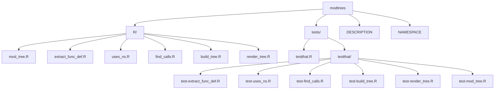

<!-- README.md is generated from README.Rmd. Please edit that file -->

```{r, include = FALSE}
knitr::opts_chunk$set(
  collapse = TRUE,
  comment = "#>",
  fig.path = "man/figures/README-",
  out.width = "100%"
)
```

# modtrees



<!-- badges: start -->
<!-- badges: end -->

The goal of `modtrees` is to create plain-text tree views of module and namespace hierarchy by statically parsing R source files.

## Installation

You can install the development version of `modtrees` like so:

``` r
install.packages("remotes")
remotes::install_github("mjfrigaard/modtrees")
```

## Example

This is a basic example which shows you how to solve a common problem:

```{r example}
library(modtrees)
## basic example code
```
