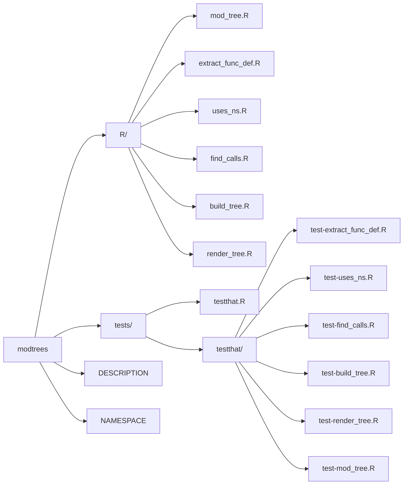

<!-- README.md is generated from README.Rmd. Please edit that file -->

```{r, include = FALSE}
knitr::opts_chunk$set(
  collapse = TRUE,
  comment = "#>",
  fig.path = "man/figures/README-",
  out.width = "100%"
)
```

# modtrees

<!-- badges: start -->
<!-- badges: end -->

The goal of `modtrees` is to create plain-text tree views of module and namespace hierarchy by statically parsing R source files.

## Installation

You can install the development version of `modtrees` like so:

``` r
install.packages("remotes")
remotes::install_github("mjfrigaard/modtrees")
```

## Example

This is a basic example which shows you how to solve a common problem:

```{r example}
library(modtrees)
```

Example using the [`ttdviewer` source code](https://github.com/mjfrigaard/ttdviewer) files: 

```bash
R
├── app_server.R
├── app_ui.R
├── ctr.R
├── inspect_plot.R
├── launch.R
├── load_tt_data.R
├── logr_msg.R
├── mod_input.R
├── mod_list.R
├── mod_plot.R
├── mod_report_desc.R
├── mod_report_download.R
├── mod_report_input.R
├── mod_table.R
├── render_report.R
└── testthat.R

1 directory, 16 files
```

Use the `mod_tree()` function to print a module namespace tree:

```r
mod_tree(
  path = "R", 
  app_fun = "launch", 
  ui_fun = "app_ui", 
  server_fun = "app_server"
  )
```

```verbatim
█─launch
├─█─app_ui
│ ├─█─mod_input_ui
│ ├─█─mod_report_input_ui
│ ├─█─mod_report_desc_ui
│ ├─█─mod_report_download_ui
│ ├─█─mod_list_ui
│ ├─█─mod_table_ui
│ └─█─mod_plot_ui
└─█─app_server
  ├─█─mod_input_server
  ├─█─mod_report_input_server
  ├─█─mod_report_desc_server
  ├─█─mod_list_server
  ├─█─mod_table_server
  ├─█─mod_plot_server
  └─█─mod_report_download_server 
```

### Structure


